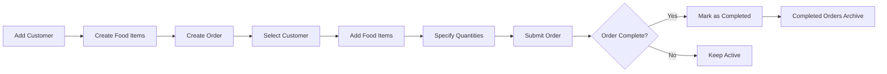

# 🍽️ Food Management System

> A smart and simplified food ordering and inventory control system built with ASP.NET Core MVC

[](https://dotnet.microsoft.com/)
[](https://docs.microsoft.com/aspnet/core)
[](https://docs.microsoft.com/ef/core)

**Name:** Jatin  
**Year:** 2025

---

## 📖 About The Project

The Food Management System is a comprehensive web-based platform designed to streamline restaurant operations by managing customers, food inventory, and orders in a centralized dashboard. Built with modern ASP.NET Core MVC architecture, it provides an intuitive interface for tracking orders from creation to completion while maintaining detailed records of all transactions.

### ✨ Key Highlights

- **Real-time Dashboard** with live statistics and system overview
- **Complete CRUD Operations** for customers, food items, orders, categories, and suppliers
- **Order Lifecycle Management** from creation to completion tracking
- **Category Management** for organizing food items
- **Supplier Management** for tracking food sources
- **Data Validation** ensuring accuracy and consistency
- **API Support** with dedicated API controllers
- **Scalable Architecture** ready for future enhancements

---

## 🎯 Project Objectives

- ✅ Efficiently manage food inventory, customers, and orders
- ✅ Provide centralized monitoring through an intuitive dashboard
- ✅ Streamline order processing workflow
- ✅ Implement scalable and maintainable MVC architecture
- ✅ Demonstrate practical application of Entity Framework Core

---

## 🚀 Features

### 📊 Dashboard
- Quick statistics overview (customers, food items, orders, categories)
- Real-time system status monitoring
- Visual summary of business operations

### 👥 Customer Management
- Complete CRUD operations for customer records
- Email validation and required field enforcement
- Customer profile management with contact details

### 🏷️ Category Management
- Organize food items by categories
- Easy category assignment and updates
- Category-based filtering and reporting

### 🍕 Food Item Management
- Menu item catalog with pricing and descriptions
- Category-based organization
- Easy updates for seasonal or promotional items
- Organized food inventory tracking

### 🚚 Supplier Management
- Manage supplier information and contacts
- Track food sources and vendor relationships
- Supplier-wise inventory management

### 📝 Order Management
- Multi-item order creation with customer linking
- Automatic quantity and price calculations
- Order details tracking with OrderDetail model
- Order status tracking (Active/Completed)
- Comprehensive order history

### 🔌 API Support
- RESTful API endpoints for external integrations
- Dedicated API controllers folder

### ✅ Completed Orders
- Separate view for fulfilled orders
- Historical record maintenance
- Easy reference for past transactions

---

## 🛠️ Technology Stack

| Component | Technology |
|-----------|-----------|
| **Frontend** | HTML5, CSS3, Bootstrap 5 |
| **Backend** | ASP.NET Core MVC (C#) |
| **Database** | Microsoft SQL Server |
| **ORM** | Entity Framework Core |
| **IDE** | Visual Studio 2022 |
| **Framework** | .NET 8.0 |

---

## ⚙️ Installation & Setup

### Prerequisites

Ensure you have the following installed:

- [Visual Studio 2022](https://visualstudio.microsoft.com/)
- [.NET SDK 8.0](https://dotnet.microsoft.com/download) or higher
- [Microsoft SQL Server](https://www.microsoft.com/sql-server)

### Installation Steps

1. **Clone the repository**
   ```bash
   git clone <repository-url>
   cd FoodMgmt
   ```

2. **Open the solution**
   - Launch Visual Studio 2022
   - Open `FoodMgmt.sln`

3. **Configure database connection**
   
   Update `appsettings.json` with your SQL Server connection:
   ```json
   {
     "ConnectionStrings": {
       "DefaultConnection": "Server=YOUR_SERVER_NAME;Database=FoodMgmt;Trusted_Connection=True;TrustServerCertificate=True;"
     }
   }
   ```

4. **Apply database migrations**
   
   Open **Package Manager Console** (Tools → NuGet Package Manager → Package Manager Console) and run:
   ```powershell
   Update-Database
   ```

5. **Run the application**
   - Press `F5` or click the **Run** button
   - The application will launch in your default browser

---

## 📁 Project Structure

```
FoodMgmt/
│
├── 📂 js/                    # JavaScript Files
│
├── 📂 lib/                   # Client-side Libraries
│
├── 📄 favicon.ico            # Application Icon
│
├── 📂 Controllers/           # MVC Controllers
│   ├── CategoriesController.cs
│   ├── CustomersController.cs
│   ├── DashboardController.cs
│   ├── FoodItemsController.cs
│   ├── HomeController.cs
│   ├── OrdersController.cs
│   └── SuppliersController.cs
│
├── 📂 Data/                  # Database Layer
│   ├── AppDbContext.cs
│   └── AppDbContextFactory.cs
│
├── 📂 Migrations/            # EF Core Migrations
│
├── 📂 Models/                # Data Models
│   ├── 📂 ViewModels/       # View Models
│   ├── Category.cs
│   ├── Customer.cs
│   ├── ErrorViewModel.cs
│   ├── FoodItem.cs
│   ├── Order.cs
│   ├── OrderDetail.cs
│   └── Supplier.cs
│
├── 📂 Views/                 # Razor Views
│   ├── 📂 Categories/
│   ├── 📂 Customers/
│   ├── 📂 Dashboard/
│   ├── 📂 FoodItems/
│   ├── 📂 Home/
│   ├── 📂 Orders/
│   ├── 📂 Shared/
│   └── 📂 Suppliers/
│
├── 📄 .gitignore            # Git Ignore File
│
├── 📄 appsettings.json      # Configuration
│
└── 📄 Program.cs            # Application Entry Point
```

---

## 🔄 Application Workflow



### Step-by-Step Process

1. **Customer Registration** → Add customer details (name, email, contact)
2. **Menu Setup** → Create food items with prices and descriptions
3. **Order Creation** → Select customer and add food items with quantities
4. **Order Processing** → System calculates totals automatically
5. **Order Completion** → Mark orders as completed when fulfilled
6. **Dashboard Monitoring** → View real-time statistics and system health

---

## 💾 Database Schema

### Entity Relationships

```
Customers (1) ────< Orders (M)
                      │
                      │
                      └────< OrderItems (M) >──── FoodItems (1)
```

### Tables Overview

| Table | Description | Key Fields |
|-------|-------------|------------|
| **Customers** | Customer information | Id, Name, Email, Contact |
| **Categories** | Food item categories | Id, Name, Description |
| **FoodItems** | Menu items catalog | Id, Name, Price, Description, CategoryId |
| **Suppliers** | Supplier information | Id, Name, Contact, Email, Address |
| **Orders** | Order headers | Id, CustomerId, OrderDate, IsCompleted |
| **OrderDetails** | Order line items | Id, OrderId, FoodItemId, Stock, Price |

---

## 🎨 User Interface

### 1. Dashboard
- Summary cards displaying total customers, food items, and orders
- Quick navigation to all major sections

### 2. Customer Management
- List view with search and filter options
- Forms for adding/editing customer information
- Delete confirmation dialogs

### 3. Food Items Catalog
- Grid layout of all menu items
- Inline editing capabilities
- Price and description management

### 4. Order Creation
- Step-by-step order form
- Dynamic food item selection
- Real-time total calculation

### 5. Completed Orders Archive
- Historical view of fulfilled orders
- Detailed order information
- Customer and item breakdowns

---

## 📚 Key Learning Outcomes

This project demonstrates proficiency in:

- ✅ **MVC Architecture Pattern** with clear separation of concerns
- ✅ **Entity Framework Core** for database operations and migrations
- ✅ **Repository Pattern** for data access abstraction
- ✅ **ViewModel Pattern** for efficient data transfer between layers
- ✅ **CRUD Operations** across multiple related entities
- ✅ **Data Validation** using annotations and custom validators
- ✅ **Relationship Management** (one-to-many, many-to-many)

---

## 🔮 Future Enhancements

### Planned Features

- [ ] **Billing Module** - Generate invoices and process payments
- [ ] **User Authentication** - Role-based access control (Admin/Staff/Manager)
- [ ] **PDF Generation** - Export orders and invoices as PDF documents
- [ ] **Reporting System** - Sales analytics and business insights
- [ ] **Email Notifications** - Order confirmations and updates
- [ ] **Table Management** - Restaurant table allocation system
- [ ] **API Development** - RESTful API for mobile app integration

---

## 🤝 Contributing

Contributions, issues, and feature requests are welcome! Feel free to check the issues page.

---


This project is developed as part of training at **Amnil Pvt. Ltd.**

---

## 👨‍💻 Developer

**Jatin**  
Software Developer Trainee  
Amnil Pvt. Ltd.

---

## 🙏 Acknowledgments

- Amnil Pvt. Ltd. for the learning opportunity
- ASP.NET Core MVC documentation and community
- Bootstrap for the responsive UI framework

---
